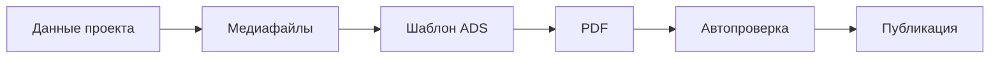

---

# ADS — Avangard Design Standard

> **Версия:** 1.1  
> **Статус:** базовый корпоративный дизайн-стандарт  
> **Дата:** 1 августа 2026 года  
> **Предшественник:** `ADS-1.0.md` (AVGST Brand System 1.0)  
> **Связанные документы:** `AES-1.0.md`, `AVGST_Brandbook_2026.pdf`  
> **Основание:** айдентика [avgst.ru](https://avgst.ru/) + каноническая реализация Product UI через [shadcn/ui](https://ui.shadcn.com/)

---

## 1. Что такое ADS

**Avangard Design Standard (ADS)** — единый стандарт визуальной системы, коммуникации и Product UI бренда Авангард Строй / AVGST.

ADS определяет:

- платформу бренда и характер коммуникации;
- правила логотипа, цвета, типографики и композиции;
- дизайн-токены и их маппинг в runtime;
- канон Product UI для веб-продуктов;
- правила медиа, PDF и дилерского co-branding;
- критерии приёмки интерфейсов и материалов;
- инструкции для разработчиков и AI-агентов при реализации UI.

Главный принцип Product UI:

> **В веб-продуктах каноническая реализация интерфейса — shadcn/ui в том виде, как компоненты выглядят и устроены в официальной документации. Бренд Avangard выражается темой (CSS variables / tokens), а не самописными заменами primitives.**

ADS не заменяет AES. AES задаёт инженерию продукта; ADS задаёт, как продукт выглядит и говорит.

---

## 2. Нормативные слова

В документах ADS используются уровни требований, согласованные с AES:

- **ОБЯЗАТЕЛЬНО** — требование должно выполняться, кроме документированного исключения.
- **СЛЕДУЕТ** — рекомендуемая практика; отклонение должно иметь причину.
- **ДОПУСТИМО** — разрешённый вариант.
- **ЗАПРЕЩЕНО** — практика не допускается.
- **УСЛОВНО** — применяется только при выполнении критериев.

---

## 3. Структура стандарта

| Раздел | Назначение |
|---|---|
| `00-meta` | назначение, связь с AES, слои |
| `10-brand` | платформа бренда, логотип, ToV |
| `20-tokens` | цвет, типографика, radius, spacing |
| `30-product-ui` | shadcn-канон, каталог компонентов, состояния |
| `40-media` | фото, CGI, паспорт медиа |
| `50-channels` | PDF, каталоги, презентации |
| `60-dealer` | co-branding и модель цены |
| `70-runtime` | CSS/theme mapping, portal-web |
| `80-governance` | приоритеты внедрения, чек-листы, changelog |

---

## 4. Связь с AES

| Стандарт | Отвечает на вопрос |
|---|---|
| **AES** | Как спроектировать, построить, проверить и эксплуатировать продукт |
| **ADS** | Как продукт выглядит, говорит и собирает UI |

Из AES § UI/UX для веб-контура СЛЕДУЕТ:

- Next.js App Router;
- TypeScript strict;
- Tailwind;
- **shadcn/ui** как системные primitives;
- React Hook Form + Zod для форм;
- TanStack Table для сложных таблиц.

ADS уточняет AES для визуального слоя:

- какой registry и style shadcn каноничны;
- как бренд-цвета мапятся на `--primary` и соседние tokens;
- какие варианты `Button` / `Badge` / `Card` допустимы;
- когда можно собирать composite-блок поверх primitives.

---

## 5. Слои ADS

ADS разделён на четыре слоя. Смешивать правила слоёв ЗАПРЕЩЕНО без явной пометки.

### 5.1. Brand foundation

Независимо от фреймворка:

- суть и характер бренда;
- логотип;
- Tone of Voice;
- фото и архитектурные визуализации;
- дилерский co-branding на уровне смысла и данных.

### 5.2. Design tokens

Машиночитаемые значения:

- цвет;
- типографика;
- radius;
- spacing;
- shadow / border;
- z-index и motion (минимально).

В веб-runtime токены ОБЯЗАТЕЛЬНО публикуются как CSS variables, совместимые с shadcn theme contract.

### 5.3. Product UI (web)

ОБЯЗАТЕЛЬНО для кабинетов, внутренних сервисов и новых веб-интерфейсов экосистемы:

- компоненты из registry shadcn/ui;
- внешний вид и API вариантов — как в документации shadcn;
- бренд — через theme tokens, не через fork разметки.

### 5.4. Channel-specific

Вне shadcn-runtime:

- PDF-каталоги;
- коммерческие предложения;
- презентации;
- печатные и outdoor-материалы.

Эти каналы наследуют Brand foundation и tokens, но не обязаны использовать React-компоненты shadcn.

---

## 6. Платформа бренда

### 6.1. Суть бренда

AVGST — рациональный бренд современного промышленного домостроения.

Айдентика строится не вокруг абстрактной «загородной мечты», а вокруг понятного продукта:

- собственного производства;
- современной архитектуры;
- конкретной технологии;
- известной комплектации;
- контролируемого срока;
- понятной цены;
- возможности выбрать, рассчитать и заказать дом без лишней неопределённости.

### 6.2. Позиционирование

> AVGST — заводской продукт в современной архитектуре, который можно выбрать, посчитать и заказать без лишней неопределённости.

### 6.3. Характер бренда

| Характеристика | Выражение |
|---|---|
| Производственный | Собственная технологическая и производственная база |
| Прозрачный | Конкретные характеристики, комплектации и цены |
| Современный | Чистая архитектура, промышленная технология, digital-first |
| Надёжный | Строгая подача без визуального и смыслового шума |
| Рациональный | Факты и измеримые параметры важнее рекламных обещаний |
| Доступный для понимания | Клиенту не нужно знать строительную терминологию, чтобы разобраться в предложении |

### 6.4. Визуальное впечатление

Материалы должны выглядеть: современно, технологично, аккуратно, спокойно, конструктивно, убедительно, коммерчески понятно.

Материалы НЕ должны выглядеть: вычурно; премиально ради премиальности; фольклорно или «по-дачному»; чрезмерно эмоционально; декоративно перегруженно; как универсальный шаблон строительной компании; как произвольный AI-dashboard на фиолетовых градиентах.

---

## 7. Логотип

Правила логотипа наследуются из Brand foundation и не зависят от shadcn.

### 7.1. Состав знака

Основной логотип состоит из:

- наклонённой скруглённой рамки;
- архитектурной монограммы;
- жёлтой конструктивной грани;
- текстового блока «Авангард Строй».

### 7.2. Версии

| Версия | Когда |
|---|---|
| Горизонтальная | По умолчанию: шапка, документы, каталоги, КП, дилерские материалы |
| Квадратная | Аватары, favicon, иконки приложений, компактные зоны |
| Инверсная | Графит / чёрный / фирменный зелёный / тёмное фото с ровной зоной |

Предпочтительное исполнение горизонтальной версии: чёрный знак, жёлтая конструктивная грань, белый или очень светлый фон.

В инверсной версии основной цвет знака — белый. Жёлтый акцент сохраняется только при достаточном контрасте.

### 7.3. Охранное поле

Базовая единица `X` — высота жёлтого дверного проёма в монограмме.

Минимум свободного пространства: `1X` со всех сторон.

В охранном поле ЗАПРЕЩЕНО размещать текст, фото, другие логотипы, декоративные линии, интерфейсные элементы, края контейнера.

### 7.4. Минимальный размер

| Среда | Минимум |
|---|---:|
| Печать | 32 мм по ширине |
| Цифровой интерфейс | 150 px по ширине |

Если места меньше — квадратный знак без текстового блока.

### 7.5. Запрещённые изменения

ЗАПРЕЩЕНО: менять пропорции; выравнивать/менять наклон рамки; перестраивать монограмму; заменять фирменный жёлтый произвольным цветом; градиент внутри знака; тень/свечение/объём; декоративную обводку; шумный фон; перенабор текстовой части другим шрифтом; менять взаимное расположение знака и текста.

---

## 8. Цветовая система

### 8.1. Принцип преемственности

Палитра ADS 1.1 сохраняет узнаваемость AVGST:

- **зелёный** остаётся основным коммерческим и action-цветом;
- **жёлтый** остаётся фирменным импульсом (логотип, редкий промо-акцент);
- нейтрали остаются **холодными**;
- тёплые кремовые/бежевые фоны НЕ являются базой айдентики.

Допустима тонкая калибровка оттенков под контраст WCAG и shadcn theme, если сохраняется близость к эталону 1.0.

### 8.2. Brand anchors (эталон преемственности)

| Token | Название | HEX | Назначение |
|---|---|---|---|
| `brand.green` | Avangard Green | `#48B062` | Primary action, цена, доверие |
| `brand.greenHover` | Avangard Green Hover | `#44A75D` | Только hover/pressed для green surfaces вне shadcn opacity-модели |
| `brand.yellow` | Avangard Yellow | `#FCC90C` | Логотип, редкий промо-импульс |
| `brand.ink` | Avangard Ink | `#111111` | Высокий контраст текста |
| `brand.graphite` | Avangard Graphite | `#242424` | Тёмные поверхности / marketing dark |
| `brand.page` | Avangard Paper | `#F5F6F8` | Фон страницы кабинета |
| `brand.mist` | Avangard Mist | `#EEF0F4` | Secondary / muted surfaces |
| `brand.line` | Avangard Line | `#DBDBDB` | Печать и legacy; в web-теме заменён каноничным `border` (§16.3) |

HEX здесь — эталон бренда и источник конвертации. Рабочие значения web-темы задаются в OKLCH (§16.2), таблица соответствия — §16.3.

### 8.3. Runtime contract — shadcn semantic tokens

В Product UI каноническими являются **семантические** переменные shadcn. Brand anchors мапятся в них.

| shadcn token | ADS mapping | Правило |
|---|---|---|
| `--background` | white / card | Поверхность компонентов |
| `--foreground` | `brand.ink` | Основной текст |
| `--card` | white | Карточки |
| `--card-foreground` | `brand.ink` | Текст на карточке |
| `--popover` | white | Popover / dropdown |
| `--primary` | `brand.green` | Главное действие |
| `--primary-foreground` | `#FFFFFF` | Текст на primary |
| `--secondary` | `brand.mist` | Вторичная заливка |
| `--secondary-foreground` | `brand.ink` | Текст на secondary |
| `--muted` | `brand.mist` | Приглушённые поверхности |
| `--muted-foreground` | канон shadcn | Вторичный текст; брендовый `#999999` слишком светлый для AA |
| `--accent` | `brand.mist` | UI hover/focus surface (**не** brand yellow) |
| `--accent-foreground` | `brand.ink` | Текст на accent surface |
| `--destructive` | канон shadcn | Красный семантический, не фирменный |
| `--border` | канон shadcn | Границы; брендовый `#DBDBDB` остаётся печатной ссылкой |
| `--input` | = border | Поля ввода |
| `--ring` | `brand.green` | Focus ring |
| `--chart-1` … `--chart-5` | палитра графиков | Charts и chart-блоки |

Токены сайдбара — отдельная группа контракта, ОБЯЗАТЕЛЬНАЯ при использовании `Sidebar`:

| shadcn token | ADS mapping | Правило |
|---|---|---|
| `--sidebar` | чуть светлее/темнее `--background` | Поверхность сайдбара |
| `--sidebar-foreground` | `brand.ink` | Текст сайдбара |
| `--sidebar-primary` | `brand.green` | Активный пункт, CTA сайдбара |
| `--sidebar-primary-foreground` | `#FFFFFF` | Текст на активном пункте |
| `--sidebar-accent` | `brand.mist` | Hover/selected пункта |
| `--sidebar-accent-foreground` | `brand.ink` | Текст на hover |
| `--sidebar-border` | = `--border` | Разделители в сайдбаре |
| `--sidebar-ring` | `brand.green` | Focus внутри сайдбара |

Расширения темы Avangard (добавляются по каноничной процедуре «Adding New Tokens»: `:root` + `.dark` + `@theme inline`):

| Token | ADS mapping | Правило |
|---|---|---|
| `--brand-yellow` | `brand.yellow` | Логотип, редкий промо-импульс |
| `--brand-yellow-foreground` | `brand.ink` | Текст на жёлтом |
| `--page` | `brand.page` | Фон рабочей области кабинета (не путать с `--background`) |

Правила:

- ОБЯЗАТЕЛЬНО в Product UI ссылаться на semantic tokens (`bg-primary`, `text-muted-foreground`), а не на разовые HEX в JSX.
- ОБЯЗАТЕЛЬНО определять **полный** набор токенов контракта, включая `sidebar-*` и `chart-*`; частичная тема ломает канонические компоненты.
- ОБЯЗАТЕЛЬНО добавлять собственные токены только парой surface/`-foreground` и через `@theme inline`.
- `--accent` в shadcn — это UI-state surface, **не** жёлтый бренд. Жёлтый живёт в `--brand-yellow`.
- Зелёный НЕ должен становиться сплошной декоративной заливкой экрана.
- Жёлтый ЗАПРЕЩЕНО использовать как массовый цвет кнопок на одном экране.

### 8.3.1. Формат значений

Рабочий формат токенов в CSS — **OKLCH**, как в каноничной теме shadcn: он корректно ведёт себя в `color-mix`, opacity-модификаторах (`bg-primary/90`) и при калибровке контраста.

HEX в §8.2 — эталон бренда и источник конвертации, а не рабочее значение в `globals.css`.

### 8.3.2. Тёмная тема

- ОБЯЗАТЕЛЬНО объявлять блок `.dark` со всеми токенами контракта: канонические компоненты содержат `dark:`-классы, и неполная тема даёт нечитаемые состояния.
- ДОПУСТИМО не выпускать переключатель темы в 1.1 — интерфейсы кабинетов остаются светлыми.
- УСЛОВНО включение dark mode как продуктовой функции: после проверки бренд-контраста зелёного и жёлтого на тёмных поверхностях.

### 8.4. Цветовая пропорция (ориентир)

| Группа | Доля |
|---|---:|
| Белый / card | 55% |
| Page / mist | 25% |
| Ink / graphite | 12% |
| Green | 6% |
| Yellow | 2% |

### 8.5. Legacy utility blue

`#00599B` ДОПУСТИМ только как временный служебный статус до унификации в semantic badge. Новые экраны СЛЕДУЕТ строить на `Badge` variants + destructive/secondary/outline.

---

## 9. Типографика

### 9.1. Семейства шрифтов

| Роль | Шрифт | Норма |
|---|---|---|
| Primary (Product UI + digital) | **Geist Sans** | ОБЯЗАТЕЛЬНО для новых веб-интерфейсов |
| Fallback / legacy / PDF при отсутствии Geist | **Inter** | СЛЕДУЕТ как резервный стек |
| Technical fallback | Arial, sans-serif | ДОПУСТИМО только как последний уровень |

Стек:

```text
Geist Sans → Inter → Arial → sans-serif
```

```css
--font-sans: var(--font-geist-sans), "Inter", Arial, sans-serif;
```

Roboto как основной шрифт новых макетов ЗАПРЕЩЁН.

### 9.2. Начертания

Допустимы: 400 Regular, 500 Medium, 600 SemiBold, 700 Bold, 800 ExtraBold (где доступно в семействе).

В Product UI СЛЕДУЕТ опираться на типографику shadcn-компонентов (`text-sm`, `font-medium` и т.д.), а не вводить параллельную шкалу классов без причины.

### 9.3. Шкала для marketing / PDF / крупных поверхностей

| Стиль | Размер / интерлиньяж | Начертание | Применение |
|---|---|---|---|
| Display | `64 / 72` | ExtraBold / Bold | Обложка, короткий hero |
| H1 | `40 / 46` | Bold | Заголовок страницы marketing |
| H2 | `28 / 34` | Bold | Раздел |
| H3 | `20 / 26` | SemiBold / Bold | Карточка / подраздел |
| Body Large | `18 / 28` | Regular | Вводный текст |
| Body | `16 / 24` | Regular | Основной текст |
| Body Small | `14 / 20` | Regular | Пояснения |
| Label | `12 / 16` | SemiBold | Метки вне shadcn-контролов |
| Caption | `10 / 14` | Regular / Medium | Метаданные |

Для кабинетов (`/company`, `/partner`) СЛЕДУЕТ использовать плотность и размеры, близкие к демо shadcn (Sidebar / Dashboard), а не Display-маркетинг.

### 9.4. Правила набора

- Длинный текст ЗАПРЕЩЕНО набирать капсом.
- Основной текст — по левому краю; justify ЗАПРЕЩЁН.
- В одном блоке — не более трёх уровней иерархии.
- Акцент — размером, начертанием и цветом, не подчёркиванием.
- Названия проектов и единицы измерения одинаковы в UI и документах.

---

## 10. Radius, spacing, surfaces

### 10.1. Radius — канон shadcn

ОБЯЗАТЕЛЬНО подогнать бренд-radius под **default shadcn**:

```css
--radius: 0.625rem; /* 10px — base */
```

Производная шкала берётся из канона shadcn без изменений — она мультипликативная, а не «плюс/минус пиксели»:

| Token | Формула | Типичное применение |
|---|---|---|
| `--radius-sm` | `calc(var(--radius) * 0.6)` | мелкие контролы, badges |
| `--radius-md` | `calc(var(--radius) * 0.8)` | кнопки, inputs (`rounded-md`) |
| `--radius-lg` | `var(--radius)` | карточки, крупные блоки |
| `--radius-xl` | `calc(var(--radius) * 1.4)` | контейнеры, медиа |
| `--radius-2xl` | `calc(var(--radius) * 1.8)` | крупные секции |
| `--radius-3xl` | `calc(var(--radius) * 2.2)` | редкие marketing-блоки |
| `--radius-4xl` | `calc(var(--radius) * 2.6)` | редкие marketing-блоки |

ЗАПРЕЩЕНО переопределять производные формулы: единственная точка настройки геометрии — `--radius`.

Параллельные брендовые `radius.control: 6px` / `radius.card: 8px` из ADS 1.0 — **сняты**. ЗАПРЕЩЕНО возвращать их в Product UI.

Для медиа (фото проекта) ДОПУСТИМО `rounded-lg` / `rounded-xl` в рамках той же шкалы.

### 10.2. Spacing

ОБЯЗАТЕЛЬНО использовать spacing-шкалу Tailwind (4px base), согласованную с shadcn demos.

ЗАПРЕЩЕНЫ произвольные «магические» отступы вне шкалы без причины.

### 10.3. Surfaces и тени

- Фон страницы кабинета: `--page` (`brand.page`).
- Поверхность компонентов: `--background` / `--card`.
- Разделение — border и смена surface, а не тяжёлая тень.
- Тени — только те, что даёт канон shadcn (`shadow-xs` / `shadow-sm` у Card/Dialog и т.п.).
- «Пузырьковые» сверхскругления и multi-layer glow ЗАПРЕЩЕНЫ.

### 10.4. Сетка

```yaml
grid:
  columns: 12
  page_margin: 24-32px
  gutter: 16-24px
```

Композиция:

1. Один главный визуальный фокус на экран / разворот.
2. Один доминирующий CTA.
3. Зелёный и жёлтый — локально.
4. Ритм отступов важнее декоративных разделителей.
5. Фото дома — достаточно крупное, не «иконка».

---

## 11. Product UI: shadcn как канон

### 11.1. Нормы

Для Product UI (B2B-портал, внутренние сервисы, новые web-экраны):

- ОБЯЗАТЕЛЬНО использовать компоненты из registry **`@shadcn`**.
- ОБЯЗАТЕЛЬНО стиль проекта: **`new-york`** (как в `components.json`), пока ADR не зафиксирует иное.
- ОБЯЗАТЕЛЬНО внешний вид и поведение variants = документация / официальные примеры shadcn.
- ОБЯЗАТЕЛЬНО устанавливать компоненты через CLI / MCP shadcn (`npx shadcn@latest add …`), а не копировать «похожий» JSX вручную без registry.
- ЗАПРЕЩЕНО создавать параллельные `PrimaryButton` / `AvgstCard` с собственной геометрией, если есть аналог в shadcn.
- ДОПУСТИМЫ composite-компоненты (`DashboardShell`, `ProjectCard`) **только** как сборка из shadcn primitives + tokens.
- УСЛОВНО кастомный primitive — только если в registry нет аналога; решение СЛЕДУЕТ зафиксировать (короткая запись / ADR).

### 11.2. Референс внешнего вида

Эталон:

1. [ui.shadcn.com](https://ui.shadcn.com/) — внешний вид и API.
2. MCP `user-shadcn` → `get_item_examples_from_registries` — полные demos.
3. Тема Avangard — только CSS variables.

Критерий приёмки:

> Если убрать логотип AVGST, экран всё ещё должен читаться как аккуратный shadcn/new-york интерфейс, а не как уникальный самодельный UI-kit.

### 11.3. Каталог соответствий

| Задача | Канон shadcn | Brand / usage |
|---|---|---|
| Главное действие | `Button` `variant="default"` | `--primary` = green |
| Вторичное | `Button` `outline` / `secondary` | neutrals |
| Тихий action | `Button` `ghost` | toolbar / row actions |
| Ссылка-действие | `Button` `link` | inline |
| Destructive | `Button` `destructive` + `AlertDialog` | удаление / отклонение |
| Промо-импульс (жёлтый) | редко: `Button` + `className` на `--brand-yellow` **или** `Badge` / banner | max 1 заметный акцент на view |
| Карточка / секция | `Card`, `CardHeader`, `CardTitle`, `CardDescription`, `CardContent`, `CardFooter` | surfaces |
| Статистика | `Card` + типографика | overview |
| Навигация кабинета | `Sidebar` (+ `SidebarProvider`, menu primitives) | company/partner shell |
| Таблица | `Table` (+ TanStack Table по AES) | списки заявок, лидов, sync |
| Формы | `Field`, `Label`, `Input`, `Textarea`, `Select`, `Checkbox` | RHF + Zod |
| Вкладки / фильтры | `Tabs` | каталог, настройки |
| Статус | `Badge` | semantic |
| Модалка | `Dialog` / `Sheet` | формы, детали |
| Подтверждение | `AlertDialog` | destructive |
| Разделители | `Separator` | — |
| Хлебные крошки | `Breadcrumb` | drill-down |
| Пустые/ошибочные состояния | композиция `Card` + текст + `Button` | обязательные состояния AES |

### 11.4. Кнопки: замена YAML из ADS 1.0

| Было в 1.0 | Стало в 1.1 |
|---|---|
| `button_primary` green YAML | `Button` `default` |
| `button_secondary` border YAML | `Button` `outline` |
| `button_accent` yellow YAML | редкий promo на `--brand-yellow` или `Badge`/banner; не конкурирует с primary |

Hover для primary в Product UI СЛЕДУЕТ модели shadcn (`hover:bg-primary/90`), а не отдельному обязательном HEX-классу в каждом месте.

### 11.5. Обязательные состояния экрана

Каждый data-driven экран ОБЯЗАТЕЛЬНО имеет (согласовано с AES):

- loading;
- empty dataset;
- empty search/filter result;
- error;
- success (если есть мутация);
- disabled/partial, если применимо.

### 11.6. Иконографика Product UI

- ОБЯЗАТЕЛЬНО для новых shadcn-экранов: **Lucide** (как в `components.json` → `iconLibrary: "lucide"`).
- ДОПУСТИМ Tabler только в legacy-коде до миграции экрана.
- ЗАПРЕЩЕНО смешивать Lucide и Tabler в одном новом экране.
- Стиль: линейные, единый stroke, без emoji и 3D-пиктограмм.
- Базовые размеры — как в shadcn demos (`size-4` в кнопках и т.п.).

### 11.7. Доступность

Цель — WCAG 2.2 AA для значимых интерфейсов (AES).

Минимум: keyboard, visible focus (`ring`), semantic HTML, labels, contrast, status для screen reader, адекватные touch targets, `prefers-reduced-motion`.

---

## 12. Фотографии и архитектурные визуализации

### 12.1. Главный принцип

> Дом — герой кадра.

### 12.2. Стиль

| Параметр | Требование |
|---|---|
| Ракурс | Три четверти фасада, уровень глаз |
| Свет | Мягкий естественный дневной свет |
| Среда | Реалистичный участок / релевантный ландшафт |
| Материалы | Натуральное дерево, графитовые и нейтральные поверхности |
| Доля дома | ориентир 55–75% кадра |
| Цветокоррекция | Естественная, без избыточной насыщенности |

### 12.3. Достоверность

ЗАПРЕЩЕНО при обработке/генерации: менять архитектуру, форму, окна, этажность, кровлю, материалы, пропорции; помещать дом в нерелевантную среду; выдавать художественный референс за построенный объект.

CGI ДОПУСТИМ только при соответствии геометрии и комплектации карточке проекта.

### 12.4. Нежелательные приёмы

Кислотные закаты; чрезмерный HDR; неестественная зелень; туман, скрывающий дом; случайные авто/люди; растительность, закрывающая фасад; «люксовая» стилизация не в характер продукта.

### 12.5. Паспорт медиафайла

```yaml
media_asset:
  project_id: ""
  project_name: ""
  house_type: "modular | panel-frame"
  asset_type: "render | photo | plan | section | detail"
  facade_variant: ""
  source_url: ""
  source_file: ""
  publication_date: ""
  actualization_date: ""
  rights_status: ""
  verified: true
```

---

## 13. Tone of Voice

### 13.1. Формула

> Говорим прямо. Считаем конкретно.

### 13.2. Характер

| Принцип | Как проявляется |
|---|---|
| Конкретно | Цифры, сроки, площадь, комплектация, цена |
| Спокойно | Без давления и гипербол |
| По-деловому | Понятно клиенту, дилеру и специалисту |
| Честно | Оговорки рядом с обещанием |
| Доступно | Сложная технология — простыми словами |

### 13.3. Примеры

Нежелательно: «Дом вашей мечты по невероятной цене.»  
Предпочтительно: «Домокомплект 124 м². Цена завода — от 5,99 млн ₽.»

Нежелательно: «Мы используем лучшие технологии.»  
Предпочтительно: «Каркас производится на заводе; узлы проходят контроль.»

Нежелательно: «Оставьте заявку прямо сейчас.»  
Предпочтительно: «Получить состав комплектации и расчёт доставки.»

### 13.4. Редакционные правила

- Тезис должен быть проверяемым.
- Цена — с комплектацией или ссылкой на неё.
- «От» — с объяснением, от чего зависит.
- Срок — с условиями расчёта.
- Восклицательные знаки — редко.
- ЗАПРЕЩЕНЫ неподтверждённые превосходные степени: «лучший», «самый надёжный», «уникальный».

---

## 14. Каталоги и PDF

### 14.1. Принцип

PDF продолжает digital-айдентику: крупные изображения; ясная иерархия; зелёная цена; редкий жёлтый импульс; холодные светлые фоны; строгая типографика; проверяемые данные.

Шрифт PDF: Geist, если встроен в пайплайн; иначе Inter.

### 14.2. Структура карточки проекта

**Страница 1:** крупный рендер/фото; название; тип; площадь; габариты; этажи; спальни; цена; дата актуальности; QR/ссылка; CTA.

**Страница 2:** планировка; доп. изображения; экспликация; характеристики; комплектация; доставка/монтаж; примечания.

### 14.3. Конвейер



Фиксировать: дату генерации; актуальность данных; версию прайса; версию шаблона; источник данных; дилера/регион для дилерского PDF.

---

## 15. Дилерский co-branding

### 15.1. Принцип

> Дилер меняет предложение, а не заводской продукт.

### 15.2. Зафиксировано (дилер не меняет)

Логотип и основная палитра AVGST; название проекта; архитектура; заводская комплектация; площадь и характеристики; планировки; изображения; заводская цена в исходных данных; обязательные дисклеймеры; происхождение и дата актуальности.

### 15.3. Разрешённые переменные дилера

Собственный логотип; контакты; регион; публичная дилерская цена; наценка; доставка; монтаж; локальное КП; CTA; домен/ссылка; менеджер.

### 15.4. Модель цены

```yaml
pricing:
  factory_price:
    visibility: "internal | dealer"
    editable_by_dealer: false
  dealer_price:
    visibility: "dealer | public"
    editable_by_dealer: true
  delivery_price:
    scope: "region"
  installation_price:
    scope: "dealer"
```

Публичная цена задаётся/вычисляется без перезаписи заводской цены.

---

## 16. Канонические токены (машиночитаемо)

### 16.1. JSON

```json
{
  "ads": "1.1",
  "brand": {
    "green": "#48B062",
    "greenHover": "#44A75D",
    "yellow": "#FCC90C",
    "ink": "#111111",
    "graphite": "#242424",
    "page": "#F5F6F8",
    "mist": "#EEF0F4",
    "card": "#FFFFFF",
    "line": "#DBDBDB"
  },
  "shadcn": {
    "style": "new-york",
    "baseColor": "neutral",
    "cssVariables": true,
    "colorFormat": "oklch",
    "radius": "0.625rem",
    "fontSans": "Geist Sans, Inter, Arial, sans-serif",
    "iconLibrary": "lucide",
    "darkModeTokens": "required",
    "darkModeToggle": "deferred",
    "tokenGroups": [
      "surface",
      "primary",
      "secondary",
      "muted",
      "accent",
      "destructive",
      "border",
      "ring",
      "chart-1..5",
      "sidebar-*"
    ],
    "extensions": ["page", "brand-yellow", "brand-yellow-foreground", "brand-graphite"],
    "map": {
      "primary": "brand.green",
      "ring": "brand.green",
      "sidebarPrimary": "brand.green",
      "brandYellow": "brand.yellow",
      "page": "brand.page",
      "sidebar": "brand.page",
      "destructive": "shadcn.canonical",
      "border": "shadcn.canonical",
      "mutedForeground": "shadcn.canonical"
    }
  }
}
```

### 16.2. Каноническая тема (полный скелет)

Структура файла повторяет каноничный scaffold shadcn: `@theme inline` → `:root` → `.dark` → `@layer base`. Меняются только значения, не форма контракта.

```css
@import "tailwindcss";

@custom-variant dark (&:is(.dark *));

@theme inline {
  --color-background: var(--background);
  --color-foreground: var(--foreground);
  --color-card: var(--card);
  --color-card-foreground: var(--card-foreground);
  --color-popover: var(--popover);
  --color-popover-foreground: var(--popover-foreground);
  --color-primary: var(--primary);
  --color-primary-foreground: var(--primary-foreground);
  --color-secondary: var(--secondary);
  --color-secondary-foreground: var(--secondary-foreground);
  --color-muted: var(--muted);
  --color-muted-foreground: var(--muted-foreground);
  --color-accent: var(--accent);
  --color-accent-foreground: var(--accent-foreground);
  --color-destructive: var(--destructive);
  --color-border: var(--border);
  --color-input: var(--input);
  --color-ring: var(--ring);
  --color-chart-1: var(--chart-1);
  --color-chart-2: var(--chart-2);
  --color-chart-3: var(--chart-3);
  --color-chart-4: var(--chart-4);
  --color-chart-5: var(--chart-5);
  --color-sidebar: var(--sidebar);
  --color-sidebar-foreground: var(--sidebar-foreground);
  --color-sidebar-primary: var(--sidebar-primary);
  --color-sidebar-primary-foreground: var(--sidebar-primary-foreground);
  --color-sidebar-accent: var(--sidebar-accent);
  --color-sidebar-accent-foreground: var(--sidebar-accent-foreground);
  --color-sidebar-border: var(--sidebar-border);
  --color-sidebar-ring: var(--sidebar-ring);

  /* Расширения Avangard */
  --color-page: var(--page);
  --color-brand-yellow: var(--brand-yellow);
  --color-brand-yellow-foreground: var(--brand-yellow-foreground);
  --color-brand-graphite: var(--brand-graphite);

  --radius-sm: calc(var(--radius) * 0.6);
  --radius-md: calc(var(--radius) * 0.8);
  --radius-lg: var(--radius);
  --radius-xl: calc(var(--radius) * 1.4);
  --radius-2xl: calc(var(--radius) * 1.8);
  --radius-3xl: calc(var(--radius) * 2.2);
  --radius-4xl: calc(var(--radius) * 2.6);

  --font-sans: var(--font-geist-sans), "Inter", Arial, sans-serif;
}

:root {
  --radius: 0.625rem;

  --background: oklch(1 0 0);
  --foreground: oklch(0.178 0 0);
  --card: oklch(1 0 0);
  --card-foreground: oklch(0.178 0 0);
  --popover: oklch(1 0 0);
  --popover-foreground: oklch(0.178 0 0);

  --primary: oklch(0.677 0.149 149);
  --primary-foreground: oklch(1 0 0);
  --secondary: oklch(0.968 0.004 265);
  --secondary-foreground: oklch(0.178 0 0);
  --muted: oklch(0.968 0.004 265);
  --muted-foreground: oklch(0.556 0 0);
  --accent: oklch(0.968 0.004 265);
  --accent-foreground: oklch(0.178 0 0);
  --destructive: oklch(0.577 0.245 27.325);

  --border: oklch(0.922 0 0);
  --input: oklch(0.922 0 0);
  --ring: oklch(0.677 0.149 149);

  --chart-1: oklch(0.677 0.149 149);
  --chart-2: oklch(0.857 0.174 90);
  --chart-3: oklch(0.398 0.07 227.392);
  --chart-4: oklch(0.6 0.118 184.704);
  --chart-5: oklch(0.646 0.222 41.116);

  --sidebar: oklch(0.973 0.003 265);
  --sidebar-foreground: oklch(0.178 0 0);
  --sidebar-primary: oklch(0.677 0.149 149);
  --sidebar-primary-foreground: oklch(1 0 0);
  --sidebar-accent: oklch(0.945 0.005 265);
  --sidebar-accent-foreground: oklch(0.178 0 0);
  --sidebar-border: oklch(0.912 0.004 265);
  --sidebar-ring: oklch(0.677 0.149 149);

  /* Расширения Avangard */
  --page: oklch(0.973 0.003 265);
  --brand-yellow: oklch(0.857 0.174 90);
  --brand-yellow-foreground: oklch(0.178 0 0);
  --brand-graphite: oklch(0.26 0 0);
}

.dark {
  --background: oklch(0.178 0 0);
  --foreground: oklch(0.985 0 0);
  --card: oklch(0.26 0 0);
  --card-foreground: oklch(0.985 0 0);
  --popover: oklch(0.26 0 0);
  --popover-foreground: oklch(0.985 0 0);

  --primary: oklch(0.72 0.145 149);
  --primary-foreground: oklch(0.178 0 0);
  --secondary: oklch(0.269 0 0);
  --secondary-foreground: oklch(0.985 0 0);
  --muted: oklch(0.269 0 0);
  --muted-foreground: oklch(0.708 0 0);
  --accent: oklch(0.269 0 0);
  --accent-foreground: oklch(0.985 0 0);
  --destructive: oklch(0.704 0.191 22.216);

  --border: oklch(1 0 0 / 10%);
  --input: oklch(1 0 0 / 15%);
  --ring: oklch(0.72 0.145 149);

  --chart-1: oklch(0.72 0.145 149);
  --chart-2: oklch(0.857 0.174 90);
  --chart-3: oklch(0.769 0.188 70.08);
  --chart-4: oklch(0.696 0.17 162.48);
  --chart-5: oklch(0.645 0.246 16.439);

  --sidebar: oklch(0.26 0 0);
  --sidebar-foreground: oklch(0.985 0 0);
  --sidebar-primary: oklch(0.72 0.145 149);
  --sidebar-primary-foreground: oklch(0.178 0 0);
  --sidebar-accent: oklch(0.269 0 0);
  --sidebar-accent-foreground: oklch(0.985 0 0);
  --sidebar-border: oklch(1 0 0 / 10%);
  --sidebar-ring: oklch(0.72 0.145 149);

  --page: oklch(0.178 0 0);
  --brand-yellow: oklch(0.857 0.174 90);
  --brand-yellow-foreground: oklch(0.178 0 0);
  --brand-graphite: oklch(0.26 0 0);
}

@layer base {
  * {
    @apply border-border outline-ring/50;
  }

  body {
    @apply bg-background text-foreground;
  }
}
```

### 16.3. Соответствие бренд-эталону

| Бренд (HEX, §8.2) | Runtime (OKLCH) | Комментарий |
|---|---|---|
| `#48B062` | `oklch(0.677 0.149 149)` | Прямая конвертация, оттенок сохранён |
| `#FCC90C` | `oklch(0.857 0.174 90)` | Прямая конвертация |
| `#111111` | `oklch(0.178 0 0)` | Прямая конвертация |
| `#242424` | `oklch(0.26 0 0)` | Прямая конвертация |
| `#F5F6F8` | `oklch(0.973 0.003 265)` | Холодный тон сохранён |
| `#EEF0F4` | `oklch(0.968 0.004 265)` | Выровнен до канонической светлоты `muted` |
| `#DBDBDB` | `oklch(0.922 0 0)` | **Выровнен под канон shadcn `border`** |

Осознанные отклонения от 1.0:

- граница светлее брендового `#DBDBDB` — это основной визуальный признак «как в доке shadcn»;
- `destructive` взят каноническим, а не брендовым `#F95D51`: красный семантический, не фирменный;
- холодный тон бренда сохранён в поверхностях (`page`, `sidebar`, `muted`), тексты и границы — нейтральные, как в каноне.

Alias `--avgst-*` ДОПУСТИМ временно для legacy; новые экраны СЛЕДУЕТ писать на semantic tokens shadcn. Миграция alias — P1.

---

## 17. Применение к portal-web

### 17.1. В скоупе ADS Product UI

- `/company/**` — HQ-кабинет;
- `/partner/**` — партнёрский кабинет, **кроме** публичного превью сайта.

### 17.2. Вне текущего редизайна (пока)

- `/` лендинг портала;
- `/partner/site/preview/**` — вид сайта партнёра;
- `apps/site-runtime` — движок дилерских сайтов (отдельный проход).

### 17.3. Порядок внедрения UI

1. Переписать `app/globals.css` по каноническому скелету §16.2: `@theme inline`, `:root`, `.dark`, `@layer base`, полный набор `sidebar-*` и `chart-*`.
2. Подключить Geist Sans через `next/font/google` в `app/layout.tsx`, экспортировать переменную `--font-geist-sans`; Inter остаётся вторым уровнем стека.
3. Доустановить недостающие компоненты registry (`sidebar`, `table`, `dropdown-menu`, `sheet`, `alert-dialog`, `skeleton`, `sonner` и др.) через CLI/MCP.
4. Собрать shell кабинетов на shadcn `Sidebar` вместо самописного `DashboardShell`.
5. Перевести overview `/company` и `/partner`.
6. Перевести list/detail экраны (заявки, партнёры, лиды, команда, CRM, sync, catalog).
7. Убрать самодельные кнопки/карточки там, где есть shadcn-аналог.
8. Мигрировать иконки затронутого экрана на Lucide.

### 17.4. Точки риска при миграции

- `body` сейчас красится брендовым фоном напрямую; по канону фон страницы задаётся `bg-background`, а серая рабочая область — `--page` / `--sidebar`.
- Legacy-классы `bg-avgst-*` рассыпаны по лендингу и превью сайта — их ЗАПРЕЩЕНО удалять в рамках редизайна кабинетов, пока эти зоны вне скоупа.
- Смена `--radius` с `0.375rem` на `0.625rem` меняет геометрию всех текущих экранов, включая те, что вне скоупа; изменение СЛЕДУЕТ проверять визуально на лендинге и превью.

---

## 18. Приоритеты внедрения

### P0 — канон Product UI

1. Зафиксировать shadcn `new-york` + theme mapping ADS 1.1.
2. `--radius: 0.625rem` и отказ от radius 6/8px как брендового канона.
3. Geist primary / Inter fallback.
4. Primary = green; yellow только как `--brand-yellow`.
5. Редизайн `/company` и `/partner` кабинетов по §17.

### P1 — унификация

1. Миграция legacy `--avgst-*` → `--brand-*` / semantic.
2. Lucide вместо Tabler на затронутых экранах.
3. Единые empty/loading/error паттерны.
4. Паспорт изображения в контентных пайплайнах.

### P2 — каналы и дилеры

1. PDF/шаблоны на токенах 1.1.
2. Разделение factory/dealer price в UI и документах.
3. Централизованное обновление brand assets.

---

## 19. Контрольный чек-лист

### Product UI

- [ ] Компонент взят из shadcn registry (или явно помечен как composite).
- [ ] Variants и размеры совпадают с каноном документации.
- [ ] Цвета через semantic tokens / brand anchors, не разовые HEX в разметке.
- [ ] Radius от `--radius` shadcn, производные формулы не переопределены.
- [ ] Тема содержит полный контракт: `sidebar-*`, `chart-*`, блок `.dark`.
- [ ] Новые токены объявлены парой surface/`-foreground` и выведены через `@theme inline`.
- [ ] Шрифт Geist (Inter только fallback).
- [ ] Иконки Lucide на новом/переработанном экране.
- [ ] Есть loading / empty / error.
- [ ] Один доминирующий primary CTA.

### Бренд

- [ ] Версия логотипа корректна; охранное поле соблюдено.
- [ ] Green/yellow узнаваемы и локальны.
- [ ] Нет декоративного шума и «AI-template» эстетики.

### Данные и медиа

- [ ] Название/площадь/цена/комплектация согласованы с источником.
- [ ] Изображение привязано к проекту; архитектура не искажена.
- [ ] Для дилера factory price не перезаписана.

---

## 20. Итоговый принцип

```text
Brand foundation
→ Design tokens
→ shadcn/ui Product UI
→ Channel templates (PDF / dealer)
```

Экосистема должна восприниматься как единый продукт:

```text
основной сайт
→ B2B-портал
→ дилерский лендинг
→ каталог
→ коммерческое предложение
→ документы
```

Ключевой критерий:

> Пользователь узнаёт Avangard до логотипа — по спокойной промышленной ясности; разработчик узнаёт Product UI до кастомных классов — по канону shadcn.

---

## 21. Changelog

### 1.1 — 2026-08-01

- Переименование стандарта: **Avangard Design Standard** (вместо AVGST Brand System как заголовка).
- Введение нормативных слов и слоёв по аналогии с AES.
- Product UI: **shadcn/ui (new-york) = канон**; самописные YAML-кнопки сняты.
- Типографика: **Geist Sans** primary, **Inter** fallback.
- Radius: бренд подогнан под **shadcn default `--radius: 0.625rem`**.
- Цвета: преемственность green/yellow сохранена; рабочий формат — **OKLCH**; `border`, `destructive` и `muted-foreground` выровнены под канон.
- Жёлтый отделён от shadcn `--accent` → `--brand-yellow`.
- Добавлен полный контракт темы: `sidebar-*`, `chart-*`, `.dark`, `@theme inline`.
- Производная шкала radius приведена к каноничной мультипликативной формуле (`* 0.6 … * 2.6`).
- Добавлены § применения к portal-web, точки риска миграции и правила для AI/разработки через MCP shadcn.

### 1.0 — 2026-07-23

- Исходный AVGST Brand System: бренд, палитра, Inter, кастомные UI-описания без привязки к shadcn.
