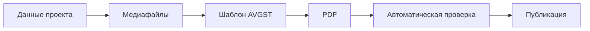

# AVGST Brand System

**Бренд:** Авангард Строй / AVGST  
**Версия:** 1.0  
**Дата:** 23 июля 2026 года  
**Основание:** исследование текущей айдентики и интерфейсов [avgst.ru](https://avgst.ru/)  
**Связанный документ:** `AVGST_Brandbook_2026.pdf`

---

## 1. Назначение документа

Этот документ описывает визуальную и коммуникационную систему AVGST в машиночитаемом текстовом формате.

Он используется как единый источник правил при разработке:

- основного сайта AVGST;
- B2B-портала для дилеров;
- дилерских сайтов и лендингов;
- каталогов проектов;
- коммерческих предложений;
- прайс-листов;
- презентаций;
- рекламных материалов;
- интерфейсов внутренних сервисов;
- автоматизированных PDF-документов;
- промптов и системных инструкций для нейросетей.

Документ содержит две категории положений:

1. **Зафиксированные элементы** — визуальные признаки, уже устойчиво используемые на avgst.ru: логотип, основная палитра, Inter, характер композиции и интерфейсные паттерны.
2. **Нормализующие рекомендации** — правила, которые устраняют найденные расхождения и превращают текущую айдентику в единую дизайн-систему.

---

## 2. Платформа бренда

### 2.1. Суть бренда

AVGST — рациональный бренд современного промышленного домостроения.

Айдентика строится не вокруг абстрактной «загородной мечты», а вокруг понятного продукта:

- собственного производства;
- современной архитектуры;
- конкретной технологии;
- известной комплектации;
- контролируемого срока;
- понятной цены;
- возможности выбрать, рассчитать и заказать дом без лишней неопределённости.

### 2.2. Позиционирование

> AVGST — заводской продукт в современной архитектуре, который можно выбрать, посчитать и заказать без лишней неопределённости.

### 2.3. Характер бренда

| Характеристика | Выражение |
|---|---|
| Производственный | Собственная технологическая и производственная база |
| Прозрачный | Конкретные характеристики, комплектации и цены |
| Современный | Чистая архитектура, промышленная технология, digital-first |
| Надёжный | Строгая подача без визуального и смыслового шума |
| Рациональный | Факты и измеримые параметры важнее рекламных обещаний |
| Доступный для понимания | Клиенту не нужно знать строительную терминологию, чтобы разобраться в предложении |

### 2.4. Визуальное впечатление

Материалы AVGST должны выглядеть:

- современно;
- технологично;
- аккуратно;
- спокойно;
- конструктивно;
- убедительно;
- коммерчески понятно.

Материалы не должны выглядеть:

- вычурно;
- премиально ради премиальности;
- фольклорно или «по-дачному»;
- чрезмерно эмоционально;
- декоративно перегруженно;
- похожими на универсальный шаблон строительной компании.

---

## 3. Логотип

### 3.1. Состав знака

Основной логотип состоит из:

- наклонённой скруглённой рамки;
- архитектурной монограммы;
- жёлтой конструктивной грани;
- текстового блока «Авангард Строй».

Наклонённая рамка ассоциируется с модулем, строительным участком и собранным конструктивом. Монограмма объединяет образ буквы «А», фасада и несущей структуры дома.

### 3.2. Основные версии

#### Горизонтальная версия

Используется по умолчанию:

- в шапке сайта;
- в документах;
- в каталогах;
- в презентациях;
- в коммерческих предложениях;
- в дилерских материалах.

Предпочтительное исполнение:

- чёрный знак;
- жёлтая конструктивная грань;
- белый или очень светлый фон.

#### Квадратная версия

Используется:

- в аватарах;
- фавиконах;
- иконках приложений;
- компактных интерфейсных областях;
- социальных сетях.

#### Инверсная версия

Используется на:

- графитовом фоне;
- чёрном фоне;
- фирменном зелёном фоне;
- тёмной фотографии при наличии ровной контрастной области.

Основной цвет знака в инверсной версии — белый. Жёлтый акцент сохраняется только при достаточном контрасте.

### 3.3. Охранное поле

За базовую единицу `X` принимается высота жёлтого дверного проёма в монограмме.

Минимальное свободное пространство вокруг логотипа:

```text
верх:   1X
низ:    1X
слева:  1X
справа: 1X
```

В охранном поле запрещено размещать:

- текст;
- фотографии;
- другие логотипы;
- декоративные линии;
- интерфейсные элементы;
- края страницы или контейнера.

### 3.4. Минимальный размер

| Среда | Минимальная ширина |
|---|---:|
| Печать | 32 мм |
| Цифровой интерфейс | 150 px |

Если доступное пространство меньше, следует использовать квадратный знак без текстового блока.

### 3.5. Запрещённые изменения

Запрещено:

- изменять пропорции логотипа;
- выравнивать или менять наклон рамки;
- перестраивать геометрию монограммы;
- заменять фирменный жёлтый произвольным цветом;
- использовать градиент внутри знака;
- добавлять тень, свечение или объём;
- добавлять декоративную обводку;
- размещать знак на визуально шумном участке изображения;
- самостоятельно перенабирать текстовую часть другим шрифтом;
- менять взаимное расположение знака и текстового блока.

---

## 4. Цветовая система

### 4.1. Основная палитра

| Токен | Название | HEX | RGB | CMYK | Назначение |
|---|---|---|---|---|---|
| `color.brand.green` | AVGST Green | `#48B062` | `72, 176, 98` | `59, 0, 44, 31` | Основное действие, цена, доверие, системный акцент |
| `color.brand.yellow` | AVGST Yellow | `#FCC90C` | `252, 201, 12` | `0, 20, 95, 1` | Логотип, внимание, промо-акцент |
| `color.text.primary` | AVGST Ink | `#111111` | `17, 17, 17` | `0, 0, 0, 93` | Заголовки, основной текст, высокий контраст |
| `color.surface.card` | AVGST White | `#FFFFFF` | `255, 255, 255` | `0, 0, 0, 0` | Карточки, фон, свободное пространство |

Значение Pantone следует определять по физической цветопробе для конкретного материала и технологии печати.

### 4.2. Роли основных акцентов

#### Зелёный

Зелёный — основной коммерческий и интерфейсный цвет.

Применяется для:

- основной кнопки;
- стоимости проекта;
- активной ссылки;
- выбранного состояния;
- положительного статуса;
- ключевой цифры;
- линейных иконок;
- небольших композиционных маркеров.

Зелёный не должен превращаться в сплошную декоративную заливку всего макета. Его задача — управлять вниманием и обозначать действие.

#### Жёлтый

Жёлтый — фирменный акцент и цвет импульса.

Применяется для:

- конструктивной части логотипа;
- акцентной кнопки;
- важной подсказки;
- короткой промометки;
- выделения приоритетной информации;
- локального цветового контраста.

Жёлтый нельзя использовать одновременно для большого количества равнозначных элементов.

### 4.3. Нейтральная палитра

| Токен | Название | HEX | Назначение |
|---|---|---|---|
| `color.black` | Black | `#000000` | Максимальный контраст |
| `color.graphite` | Graphite | `#242424` | Тёмные поверхности |
| `color.text.secondary` | Middle Grey | `#999999` | Вторичный текст и метаданные |
| `color.silver` | Silver | `#C9C9C9` | Неактивные элементы и границы |
| `color.border.default` | Line | `#DBDBDB` | Разделители и обводки |
| `color.surface.mist` | Mist | `#EEF0F4` | Контейнеры и вторичные поверхности |
| `color.surface.page` | Paper | `#F5F6F8` | Основной светлый фон страницы |
| `color.surface.card` | White | `#FFFFFF` | Карточки и контрастные светлые блоки |

Нейтральная шкала должна оставаться холодной. Тёплые бежевые и кремовые фоны не являются базовой частью айдентики.

### 4.4. Рекомендуемая цветовая пропорция

| Цветовая группа | Доля |
|---|---:|
| Белый | 55% |
| Светло-серый | 25% |
| Чёрный / графитовый | 12% |
| Зелёный | 6% |
| Жёлтый | 2% |

Пропорция является композиционным ориентиром, а не математическим ограничением для каждого экрана.

### 4.5. Служебные цвета

На сайте встречаются цвета, которые не должны становиться частью основной палитры.

| Цвет | HEX | Допустимое назначение |
|---|---|---|
| Hover Green | `#44A75D` | Наведение и нажатие для основного зелёного |
| Status Red | `#F95D51` | Ошибка, риск, предупреждение, специальный статус |
| Utility Blue | `#00599B` | Временный служебный или логистический статус |

Правила:

- `#48B062` является единственным мастер-зелёным;
- `#44A75D` используется только как `hover` или `pressed`;
- красный применяется семантически, а не декоративно;
- синий delivery-badge считается локальным исключением и подлежит унификации;
- дополнительные оттенки не вводятся без обновления дизайн-системы.

---

## 5. Типографика

### 5.1. Основной шрифт

Единственный основной шрифт бренда — **Inter**.

Причины выбора:

- уже доминирует в интерфейсе avgst.ru;
- качественно поддерживает кириллицу;
- хорошо читается в интерфейсах и документах;
- имеет нейтральный технологичный характер;
- содержит достаточное количество начертаний;
- подходит для сайта, B2B-системы и печатных материалов.

Допустимые начертания:

- Regular 400;
- Medium 500;
- SemiBold 600;
- Bold 700;
- ExtraBold 800.

Roboto и Arial допускаются только как технические fallback-шрифты. Новые макеты на них не строятся.

### 5.2. Типографическая шкала

| Стиль | Размер / интерлиньяж | Начертание | Применение |
|---|---|---|---|
| Display | `64 / 72` | ExtraBold | Короткий крупный заголовок, обложка |
| H1 | `40 / 46` | ExtraBold | Заголовок страницы |
| H2 | `28 / 34` | Bold | Заголовок раздела |
| H3 | `20 / 26` | Bold или SemiBold | Заголовок карточки или подраздела |
| Body Large | `18 / 28` | Regular | Вводный текст |
| Body | `16 / 24` | Regular | Основной текст |
| Body Small | `14 / 20` | Regular | Пояснения и интерфейс |
| Label | `12 / 16` | SemiBold | Кнопки, навигация, метки |
| Caption | `10 / 14` | Regular или Medium | Метаданные и подписи |

### 5.3. Правила набора

- Крупные заголовки могут набираться прописными буквами.
- Длинный текст нельзя набирать капсом.
- Для заголовков используется плотный, но не отрицательный трекинг.
- Основной текст выравнивается по левому краю.
- Выравнивание по ширине не применяется.
- В одном текстовом блоке используется не более трёх уровней иерархии.
- Акцент создаётся размером, начертанием и цветом, а не подчёркиванием.
- В интерфейсах и документах должны использоваться одинаковые названия проектов и единицы измерения.

---

## 6. Сетка и композиция

### 6.1. Основной принцип

Композиция AVGST строится на:

- большом количестве свободного пространства;
- крупной типографике;
- рациональной модульной сетке;
- светлых поверхностях;
- одном доминирующем действии;
- больших изображениях проектов;
- отсутствии декоративного шума.

### 6.2. Базовая desktop-сетка

```yaml
grid:
  columns: 12
  page_margin: 24-32px
  gutter: 16-24px
```

Для печатных материалов сетка адаптируется к формату, но сохраняет 12-колоночную логику.

### 6.3. Композиционные правила

1. Крупный заголовок занимает от 6 до 9 колонок.
2. На одном экране или развороте должен быть один главный визуальный фокус.
3. Основная кнопка должна визуально доминировать над вторичными действиями.
4. Карточки отделяются от страницы преимущественно цветом поверхности, а не тенью.
5. Размер и ритм отступов важнее декоративных разделителей.
6. Фотография или рендер дома должны иметь достаточную площадь и не работать как мелкая иллюстрация.
7. Зелёный и жёлтый используются локально.

### 6.4. Скругления

| Токен | Значение | Применение |
|---|---:|---|
| `radius.control` | `6px` | Кнопки, поля ввода, табы |
| `radius.card` | `8px` | Карточки |
| `radius.media` | `10-16px` | Фотографии, рендеры, крупные медиаблоки |

Чрезмерно округлые «пузырьковые» элементы не соответствуют характеру бренда.

### 6.5. Тени и границы

- Базовые карточки не используют выраженную тень.
- Для разделения применяются фон `#F5F6F8`, белая карточка и граница `#DBDBDB`.
- Если тень необходима для состояния наложения, она должна быть мягкой и почти незаметной.
- Стандартная граница — `1px solid #DBDBDB`.

---

## 7. Интерфейсные компоненты

### 7.1. Основная кнопка

```yaml
button_primary:
  background: "#48B062"
  text: "#FFFFFF"
  hover: "#44A75D"
  radius: "6px"
  font: "Inter SemiBold"
```

Применяется для главного действия:

- узнать цену;
- заказать;
- выбрать проект;
- отправить заявку;
- перейти к расчёту.

### 7.2. Акцентная кнопка

```yaml
button_accent:
  background: "#FCC90C"
  text: "#111111"
  radius: "6px"
  font: "Inter SemiBold"
```

Применяется для действия, требующего дополнительного внимания:

- получить расчёт;
- скачать каталог;
- открыть специальное предложение.

Акцентная кнопка не должна конкурировать на одном экране с несколькими такими же жёлтыми кнопками.

### 7.3. Вторичная кнопка

```yaml
button_secondary:
  background: "#FFFFFF"
  text: "#111111"
  border: "1px solid #DBDBDB"
  radius: "6px"
```

Применяется для:

- просмотра подробностей;
- возврата;
- дополнительной информации;
- действий второго приоритета.

### 7.4. Карточка проекта

Карточка проекта содержит:

1. изображение дома;
2. точное название проекта;
3. основные характеристики;
4. стоимость;
5. основное действие;
6. при необходимости — вторичное действие и статус.

Визуальная иерархия:

- поверхность карточки — белая;
- фон страницы — светло-серый;
- название — чёрное, Bold;
- характеристики — серые;
- стоимость — зелёная;
- основная кнопка — зелёная;
- статус — отдельный семантический badge.

### 7.5. Табы и фильтры

- активный таб выделяется средним серым фоном;
- неактивные табы остаются белыми;
- состояние не обозначается только цветом текста;
- границы и отступы должны быть единообразными;
- длинные наборы фильтров группируются по смыслу.

### 7.6. Состояние disabled

```yaml
disabled:
  background: "#EEF0F4"
  text: "#999999"
  border: "#DBDBDB"
```

Disabled-элемент не должен выглядеть кликабельным.

---

## 8. Иконографика

### 8.1. Стиль

Иконки:

- линейные;
- геометрически простые;
- конструктивные;
- без декоративных заливок;
- со скруглёнными окончаниями линий;
- визуально единообразные.

### 8.2. Технические параметры

```yaml
icon:
  base_sizes: [24, 32]
  stroke: "1.5-2px"
  colors:
    primary: "#48B062"
    secondary: "#111111"
```

### 8.3. Запреты

Не допускается смешивать в одном интерфейсе:

- контурные и заливные иконки;
- emoji;
- цветные пиктограммы;
- 3D-иконки;
- иконки с разной толщиной линии;
- иллюстративные и технические символы без общей системы.

---

## 9. Фотографии и архитектурные визуализации

### 9.1. Главный принцип

> Дом — герой кадра.

Изображение должно достоверно показывать конкретный проект, его архитектуру, материалы и конструктивные особенности.

### 9.2. Рекомендуемый визуальный стиль

| Параметр | Требование |
|---|---|
| Ракурс | Три четверти фасада, уровень глаз |
| Свет | Мягкий естественный дневной свет |
| Среда | Реалистичный участок, лес или релевантный ландшафт |
| Материалы | Натуральное дерево, графитовые и нейтральные поверхности |
| Доля дома в кадре | Ориентировочно 55-75% |
| Цветокоррекция | Естественная, без избыточной насыщенности |
| Композиция | Чистая, без случайных отвлекающих объектов |

### 9.3. Обязательная достоверность

При обработке и генерации изображений запрещено:

- менять архитектуру проекта;
- изменять форму здания;
- добавлять или убирать окна;
- дорисовывать несуществующие террасы;
- менять количество этажей;
- изменять уклон или тип кровли;
- заменять реальные материалы;
- искажать пропорции;
- помещать дом в нерелевантную среду;
- выдавать художественный референс за построенный объект.

CGI допустим только при соответствии геометрии, комплектации и материалов карточке проекта.

### 9.4. Нежелательные визуальные приёмы

- кислотные закаты;
- чрезмерный HDR;
- неестественно яркая зелень;
- кинематографический туман, скрывающий дом;
- избыточные блики;
- случайные автомобили и люди;
- растительность, закрывающая фасад;
- чрезмерно «люксовая» стилизация, не соответствующая продукту.

### 9.5. Паспорт медиафайла

Для каждого изображения должны храниться:

```yaml
media_asset:
  project_id: ""
  project_name: ""
  house_type: "modular | panel-frame"
  asset_type: "render | photo | plan | section | detail"
  facade_variant: ""
  source_url: ""
  source_file: ""
  publication_date: ""
  actualization_date: ""
  rights_status: ""
  verified: true
```

---

## 10. Tone of Voice

### 10.1. Основная формула

> Говорим прямо. Считаем конкретно.

AVGST говорит как компетентный производитель, который уважает время клиента и способен подтвердить свои обещания.

### 10.2. Характер коммуникации

| Принцип | Как проявляется |
|---|---|
| Конкретно | Цифры, сроки, площадь, комплектация, цена |
| Спокойно | Без давления, крика и гипербол |
| По-деловому | Понятно клиенту, дилеру и специалисту |
| Честно | Ограничения и оговорки находятся рядом с обещанием |
| Доступно | Сложная технология объясняется простыми словами |

### 10.3. Примеры формулировок

Нежелательно:

> Дом вашей мечты по невероятной цене.

Предпочтительно:

> Домокомплект 124 м². Цена завода — от 5,99 млн ₽.

Нежелательно:

> Мы используем лучшие технологии.

Предпочтительно:

> Каркас производится на заводе; узлы проходят контроль.

Нежелательно:

> Оставьте заявку прямо сейчас.

Предпочтительно:

> Получить состав комплектации и расчёт доставки.

### 10.4. Редакционные правила

- Каждый рекламный тезис должен быть проверяемым.
- Цена сопровождается указанием комплектации или ссылкой на неё.
- Если цена начинается «от», должно быть объяснено, от чего она зависит.
- Срок сопровождается условиями его расчёта.
- Технические термины раскрываются при первом употреблении.
- Восклицательные знаки используются редко.
- Запрещены неподтверждённые превосходные степени: «лучший», «самый надёжный», «уникальный».

---

## 11. Каталоги и PDF-документы

### 11.1. Принцип

PDF-документ продолжает digital-айдентику AVGST:

- крупные изображения;
- ясная иерархия;
- зелёная цена;
- жёлтый импульс;
- холодные светлые фоны;
- строгая типографика;
- проверяемые данные.

### 11.2. Рекомендуемая структура проекта в каталоге

#### Первая страница

- крупный рендер или фотография;
- название проекта;
- тип дома;
- площадь;
- габариты;
- количество этажей;
- количество спален;
- актуальная цена;
- дата актуальности;
- QR-код или ссылка на карточку проекта;
- основной CTA.

#### Вторая страница

- планировка;
- дополнительные изображения;
- экспликация помещений;
- технические характеристики;
- состав комплектации;
- условия доставки и монтажа;
- служебные примечания.

### 11.3. Конвейер сборки



Каждый выпуск должен фиксировать:

- дату генерации;
- дату актуальности данных;
- версию прайса;
- версию шаблона;
- источник проектных данных;
- дилера и регион, если документ дилерский.

---

## 12. Дилерский co-branding

### 12.1. Основной принцип

> Дилер меняет предложение, а не заводской продукт.

Система должна разделять мастер-данные AVGST и разрешённые дилерские переменные.

### 12.2. Зафиксированные элементы

Дилер не может изменять:

- логотип и основную палитру AVGST;
- название проекта;
- архитектуру и геометрию дома;
- заводскую комплектацию;
- площадь и технические характеристики;
- планировки;
- изображения проекта;
- заводскую цену в исходных данных;
- обязательные дисклеймеры;
- происхождение и дату актуальности данных.

### 12.3. Разрешённые дилерские переменные

Дилер может изменять:

- собственный логотип;
- контакты;
- регион продажи;
- публичную дилерскую цену;
- наценку;
- стоимость доставки;
- стоимость монтажа;
- локальное коммерческое предложение;
- CTA;
- домен или ссылку;
- данные ответственного менеджера.

### 12.4. Модель цены

Заводская цена и цена дилера должны храниться раздельно.

```yaml
pricing:
  factory_price:
    visibility: "internal | dealer"
    editable_by_dealer: false
  dealer_price:
    visibility: "dealer | public"
    editable_by_dealer: true
  delivery_price:
    scope: "region"
  installation_price:
    scope: "dealer"
```

Публичная цена должна вычисляться или задаваться без перезаписи заводской цены.

---

## 13. Дизайн-токены

### 13.1. Канонический набор

```json
{
  "color": {
    "brand": {
      "green": "#48B062",
      "greenHover": "#44A75D",
      "yellow": "#FCC90C"
    },
    "text": {
      "primary": "#111111",
      "secondary": "#999999",
      "inverse": "#FFFFFF"
    },
    "surface": {
      "page": "#F5F6F8",
      "mist": "#EEF0F4",
      "card": "#FFFFFF",
      "dark": "#242424"
    },
    "border": {
      "default": "#DBDBDB",
      "disabled": "#C9C9C9"
    },
    "status": {
      "danger": "#F95D51",
      "utility": "#00599B"
    }
  },
  "font": {
    "family": "Inter, Arial, sans-serif",
    "weights": {
      "regular": 400,
      "medium": 500,
      "semiBold": 600,
      "bold": 700,
      "extraBold": 800
    }
  },
  "radius": {
    "control": "6px",
    "card": "8px",
    "media": "12px"
  },
  "border": {
    "width": "1px"
  },
  "grid": {
    "columns": 12,
    "pageMargin": "32px",
    "gutter": "24px"
  }
}
```

### 13.2. CSS-представление

```css
:root {
  --avgst-green: #48b062;
  --avgst-green-hover: #44a75d;
  --avgst-yellow: #fcc90c;

  --avgst-ink: #111111;
  --avgst-graphite: #242424;
  --avgst-text-secondary: #999999;

  --avgst-page: #f5f6f8;
  --avgst-mist: #eef0f4;
  --avgst-card: #ffffff;
  --avgst-line: #dbdbdb;
  --avgst-silver: #c9c9c9;

  --avgst-danger: #f95d51;
  --avgst-utility: #00599b;

  --avgst-radius-control: 6px;
  --avgst-radius-card: 8px;
  --avgst-radius-media: 12px;

  --avgst-font-family: "Inter", Arial, sans-serif;
}
```

---

## 14. Приоритеты внедрения

### P0 — обязательная унификация

1. Использовать `#48B062` как единственный основной зелёный.
2. Использовать `#44A75D` только для hover/pressed.
3. Использовать жёлтый только как ограниченный фирменный акцент.
4. Закрепить Inter во всех новых интерфейсах и PDF.
5. Ввести единую типографическую шкалу.

### P1 — формирование дизайн-системы

1. Собрать библиотеку кнопок, карточек, табов, фильтров и badges.
2. Ввести паспорт изображения.
3. Запретить генеративную подмену архитектуры проектов.
4. Подключить каталоги и коммерческие предложения к единому источнику данных.
5. Зафиксировать версии шаблонов и прайсов.

### P2 — дилерская инфраструктура

1. Разделить мастер-данные завода и дилерские overrides.
2. Внедрить ролевую модель доступа к ценам.
3. Автоматизировать дилерские лендинги и PDF.
4. Добавить контроль актуальности публикаций.
5. Ввести централизованное обновление бренд-компонентов.

---

## 15. Контрольный чек-лист

Перед публикацией сайта, страницы, каталога или коммерческого предложения проверить:

### Бренд

- [ ] Использована правильная версия логотипа.
- [ ] Соблюдено охранное поле.
- [ ] Логотип не деформирован и не перекрашен.
- [ ] Основной зелёный — `#48B062`.
- [ ] Жёлтый используется локально.

### Типографика

- [ ] Используется Inter.
- [ ] Есть понятная иерархия заголовков.
- [ ] Основной текст не набран капсом.
- [ ] Вторичный текст остаётся читаемым.

### Композиция

- [ ] Есть один главный визуальный фокус.
- [ ] Есть один доминирующий CTA.
- [ ] Карточки не перегружены тенями.
- [ ] Сохранено достаточное свободное пространство.

### Проектные данные

- [ ] Название проекта соответствует источнику.
- [ ] Площадь и характеристики проверены.
- [ ] Цена имеет дату актуальности.
- [ ] Указана комплектация или ссылка на неё.
- [ ] Планировка относится к выбранному проекту.

### Изображения

- [ ] Архитектура не изменена.
- [ ] Пропорции дома сохранены.
- [ ] Изображение связано с конкретным проектом.
- [ ] Указан источник.
- [ ] CGI не выдаётся за построенный объект.

### Дилерские материалы

- [ ] Заводская цена не перезаписана.
- [ ] Публичная цена дилера хранится отдельно.
- [ ] Указан дилер и регион.
- [ ] Указана версия прайса.
- [ ] Обязательные дисклеймеры сохранены.

---

## 16. Итоговый принцип

Вся экосистема AVGST должна восприниматься как единый продукт:

```text
основной сайт
→ B2B-портал
→ дилерский лендинг
→ каталог
→ коммерческое предложение
→ договорные и проектные документы
```

Во всех каналах сохраняются:

- одна визуальная логика;
- одни проектные данные;
- единая цветовая система;
- единая типографика;
- проверяемая архитектура;
- прозрачная модель цены;
- понятный язык производителя.

Ключевой критерий качества:

> Пользователь должен узнавать AVGST до того, как увидит логотип, и понимать предложение до того, как обратится к менеджеру.
